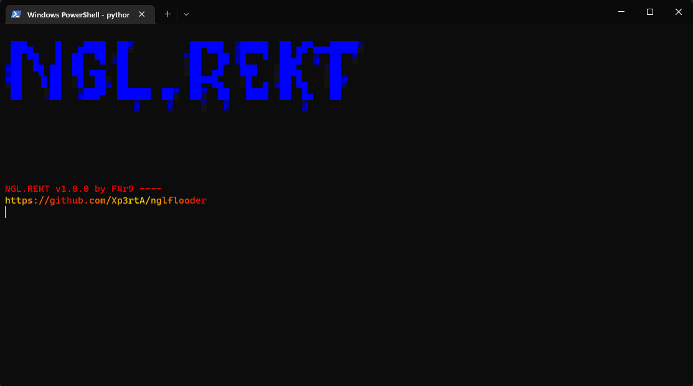

<a name="readme-top"></a>
<br />
<div align="center">
  <a href="https://github.com/Xp3rtA/nglflooder">
    
  </a>

<h3 align="center">NGL Flooder</h3>

  <p align="center">
    Did you ever wanted to flood an entire NGL account with questions? This simple python script does just that!
    <br />
        <br />
    <a href="https://github.com/Xp3rtA/nglflooder/issues">Report Bug</a>
    ·
    <a href="https://github.com/Xp3rtA/nglflooder/issues">Request Feature</a>
  </p>
</div>


<!-- ABOUT THE PROJECT -->
## About The Project



NGL.Rekt features a fully functionnal flooding tool to make your friends go crazy.
<br />
It uses the base python libraries altogether with pystyle (Made by billythegoat356 - https://github.com/billythegoat356/pystyle)

<!-- GETTING STARTED -->
## Getting Started

It is very simple to get NGL.Rekt running.

### Prerequisites

You need the latest version of python.
  ```sh
  https://www.python.org/downloads/release/python-3111/
  ```

### Installation

1. Download and place ngl_flooder.py onto your desktop.
2. Run the python file. Librairies will be downloaded automatically. ( If the librairies does not download / not work, manually install them : run pip3 install pystyle )

<!-- USAGE EXAMPLES -->
## Usage

1. Enter the victim's username, and the question number
2. Let the magic be!

<!-- ROADMAP -->
## Roadmap

- [x] Flooding
- [ ] Cloudflare bypass? (idk if possible)

See the [open issues](https://github.com/Xp3rtA/nglflooder/issues) for a full list of proposed features (and known issues).

<!-- CONTRIBUTING -->
## Contributing

Contributions are what make the open source community such an amazing place to learn, inspire, and create. Any contributions you make are **greatly appreciated**.

If you have a suggestion that would make this better, please fork the repo and create a pull request. You can also simply open an issue with the tag "enhancement".
Don't forget to give the project a star! Thanks again!

1. Fork the Project
2. Create your Feature Branch (`git checkout -b feature/AmazingFeature`)
3. Commit your Changes (`git commit -m 'Add some AmazingFeature'`)
4. Push to the Branch (`git push origin feature/AmazingFeature`)
5. Open a Pull Request


<!-- LICENSE -->
## License

You are authorized to modify the program and redistribute it, but **please give credits!**

<!-- CONTACT -->
## Contact

Twitter - [@KAMIKAZ_OFF_](https://twitter.com/KAMIKAZ_OFF_)

Project Link: [https://github.com/Xp3rtA/nglflooder](https://github.com/Xp3rtA/nglflooder)

<p align="right">(<a href="#readme-top">back to top</a>)</p>
